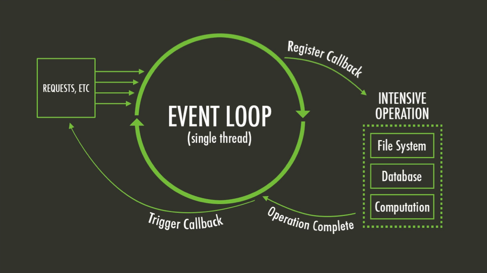

# JavaScript: témata pro začátečníky

>- [Scope](#a-scope)
>- [Hoisting](#b-hoisting)
>- [Closure](#c-closure)
>- [Object Assign](#object-assign)
>- [Split Operator](#split-operator)
>- [Nullish a Coalescing operator](#nullish-coalescing-operator)
>- [Pipe, Pipeline](#pipe--pipeline-operator)
>- [Promise](#a-promise)
>- [Async](#b-asyncawait)
>- [Callback](#c-callback)
>- [EventLoop](#event-loop)

<br/>

# **SCOPE, HOISTING, CLOSURE**
>- ### **a) SCOPE**
- Od ES6 máme v JavaScriptu 3 scopy = Global Scope, Function Scope, Block Scope.
- **Global Scope** -> proměnné deklarované jako var jsou přístupné v celém scriptu.
- **Function Scope** -> proměnné deklarované uvnitř funkce jsou lokální a lze je použít pouze v dané funkci.
- **Block Scope** -> proměnné deklarované jako const a let jsou přístupné pouze uvnitř bloku / {} ve kterém jsou deklarovány.

**POZOR!** Pokud přířadíme hodnotu proměnné, která není deklarována (např. carName = “Volvo”;), tak je proměnná automaticky globální. Pokud chceme tomuto zabránit musíme použít Strict Mode. Strict mode vyvoláme tím, že na začítek scriptu/funkce/třídy napíšeme 'use strict';
Strict Mode podporují všechny moderní prohlížeče a například při zákládání projektu v React.js pomocí template projekt automaticky běží ve strict modu.</br></br>

>- ### **b) HOISTING**

- V JavaScriptu lze proměnné používat před tím, než jsou deklarovány, protože hoisting je chování JavaScriptu při kterém jsou všechny deklarace proměnných přesunuty na začátek scriptu/blocku v závislosti na jejich scopu. Takže proměnné var jsou přesunuty na začátek scriptu, proměnné const a let jsou přesunuty na začátek blocku.</br>

**POZOR!** Přesunuty jsou pouze deklarace. Inicializace proměnných přesunuty nejsou. Takže ačkoliv jsou si funkce a program vědomy existence proměnné, stále je nelze použít dříve, než je inicializujete.

PŘÍKLAD 1
```js
let firstName = "Martin";
let lastName = "Leinweber";
console.log(firstName + " " + lastName);
//OUTPUT: Martin Leinweber
```

PŘÍKLAD 2
```js
let firstName = "Martin";
console.log(firstName + " " + lastName);
let lastName = "Leinweber";
//OUTPUT: Martin undefined
```
</br>

>- ### **c) CLOSURE**
- Closure je kombinace funkcí, která nám umožní dostat s k proměnné ke které bychom se jinak kvůli jejímu scopu nedostali.

PŘÍKLAD 1
```js
//definice funkce outerFunc
function outerFunc() {
	//definování proměnné outerVar
	let outerVar = 'I am outside!';
	//definice funkceinnerFunc()
	function innerFunc() {
		//funkce má přístup k proměnné outerVar, protože je stejně jako ona definována uvnitř lexical scopu funkce outerFunc()
		console.log(outerVar);
	}
	//vrací funkci innerFunc()
	return innerFunc;
}

//definice funkce exec()
function exec() {
	//definice funkce myInnerFunc s hodnotou funkce outerFunc(), která jak víme vrací innerFunc()
	const myInnerFunc = outerFunc();
	//console.log('I am outside!');
	myInnerFunc();
}
exec();
```
Na příkladu vidíme, že funkce exec() má díky použitému closure přístup k proměnné univtř funkce outerFunc(), kte které by za normálních okolností neměla mít přístup.
</br></br>

# OBJECT ASSIGN
```js
const target = { a: 1, b: 2 };
const source = { b: 4, c: 5 };
const returnedTarget = Object.assign(target, source);

console.log(target);
// expected output: Object { a: 1, b: 4, c: 5 }
console.log(returnedTarget);
// expected output: Object { a: 1, b: 4, c: 5 }
```
- Obejct.assign zkopíruje enumerable properties ze zdrojového objektu do cílového.
- Properties v cílovém objektu jsou přepsány, mají-li stejný key
- Používá metodu GET na zdrojovou vlastnost a SET na cílovou. Takže dochází k přiřazení vlastnosti nikoliv k jejímu zkopírování či definici nové
- Vrací upravený/modifikovaný cilový objekt.</br>

Pokud chceme definovat nebo modifikovat vlastnost přímo v daném objektu,pooužijme metodu Object.defineProperty() viz. [zdroj](https://developer.mozilla.org/en-US/docs/Web/JavaScript/Reference/Global_Objects/Object/assign)
</br></br>

# SPLIT OPERATOR
```js
const str = 'The quick brown fox jumps over the lazy dog.';
const words = str.split(' ');
console.log(words[3]);
// expected output: "fox"
const chars = str.split('');
console.log(chars[8]);
// expected output: "k"
const strCopy = str.split();
console.log(strCopy);
// expected output: Array ["The quick brown fox jumps over the lazy dog."]
```

SYNTAXE
```js
	split();
	split(separator);
	split(separator, limit);
```

- Rozdělní string na list substringů a následně ze substringů vytvoří array
- Separator je parametr popisující, kde má dojit k rozdělení stringu.
o Můžeme použít jeden či více znaků
o Při použitívíce znaků například ‘abc’ , musí být nalezena celá tato sekvence, aby došlo ke splitu.
o Pokud ve stringu neni nalezen shoda se separatorem, vrátí funkce celý původní string
o Pokud je separator prázdný string “”, je string rozdělen na jednotlivé znaky
o Pokud je separator nalezen na konci/začátku stringu, stále dojde k jeho rozdělení a na konec či začátek je přídána mezera. Funkce tedy vrátí mezeru a zbytek stringu
- Limit musí být integer >= 0 , string je rozdělen pokaždé, když je nalezen separator, ale split je zastaven když počet rozdělení dosáhne limitu.
<br>=> Pokud je limit 0, funkce vrátí prázdný array []

[zdroj](https://developer.mozilla.org/en-US/docs/Web/JavaScript/Reference/Global_Objects/String/split)
<br></br>
# NULLISH COALESCING OPERATOR
V java scriptu můžeme rozdělit hodnoty na **FALSEY** a **TRUTHY**<br>
FALSEY VALUES: null, undefined, NaN, “”, 0, false
```js
let personName = null;
let checkName = personName ?? "No name provided";
//pokud je personName hodnota null nebo undefines, tak checkName = "No name provided"

let carBrand = "";
let checkBrand = carBrand || "Unspecified Brand";
//pokud je carBrand jakakoliv falsey hodnota, tak checkBRand = "Unspecified BRand"

let personAge = 30;
let checkAge = personAge && "Valid age";
// pokud je personAge truthy value tak checkAge = "Valid age"
```
[zdroj](https://developer.mozilla.org/en-US/docs/Web/JavaScript/Reference/Operators/Nullish_coalescing_operator)
<br></br>

# PIPE / PIPELINE OPERATOR
- Piping se často používá ve funkčním programování
- Jedná se o předání výstupu jedno funkce napřímo do funkce další
- V tuto chvíli nemá JavaScript žádný pipe operátor (teprve se připravuje a je ve fázi testování nový pipe operátor |> )

```js
	const output = func3(func2(func1(input)));
	// output = input -> func1 -> func2 -> func3
```
PŘÍKLAD 1
```js
//title = input
const title = '10 Weird Facts About Dogs';
const toLowerCase = (str) => str.toLowerCase();
const addHyphens = (str) => str.replace(/\s/g, '-');

// pipe/pipeline => funkce jsou seřazeny pozpátku, protože se poslední funkci předá jako parametr funkce předposlední, atd...
const slug = addHyphens(toLowerCase(title));

console.log(slug);
//OUTPUT: 10-weird-facts-about-dogs
```
PŘÍKLAD 2 s použítím pipe funkce a rest operátoru<br>
- Pokud si vytvoříme pipe funkci, tak ji předáváme funkce jako parametry seřazené tak, jak jdou za sebou, oddělené čárkou. Je to jednodušší zápis v porovnání s prvním příkladem, kde jsme museli funkce volat v opačném pořádí a vždy předat jako parametr funkci předcházející.
```js
//vytvoření pipe funkce, které předáváme funkce jako parametry
const pipe = (...args) => args.reduce((acc, el) => el(acc));

//title = input
const title = '10 Weird Facts About Dogs';
const toLowerCase = (str) => str.toLowerCase();
const addHyphens = (str) => str.replace(/\s/g, '-');
//použití pipe funkce
const slug = pipe(title, toLowerCase, addHyphens);

console.log(slug);
//OUTPUT: 10-weird-facts-about-dogs
```
<br>

# Promise vs Async vs Callback
>- ### a) Promise
- Je objekt, který reprezentuje status/state procesu a hlídá jestli je proběhl či nikoliv. Promise používáme ve chvíli, kdy víme, že někdy v budoucnu dojde k určitému procesu. Promise má tři statusy a to Pending, Resolved,Rejected.
- Každá Promise začíná ve statusu Pending, kdy hlídá jestli už process proběhl a čeká na výsledek. Následně po skončení processu nabyde statusu buď Resolved nebo Rejected v závislosti na tom, zda skončí process úspěšně či neúspěšně.

**.then()**<br/>
Použijeme ve chvíli, kdy chceme vykonat sekvenci kódu v případě, že promise skončí úspěchem tedy resolved

**.catch()**<br/>
Použijeme pokud chceme něco vykonat v návaznosti na neúspěch promise/rejected status

**.finally()**<br/>
Nám umožní provést operaci nezávisle na tom, jak dopadne promise. Tato metoda proběhne v obou případech (resolved, rejected). Nicméně stále platí, že musí promise dojít k výsledku. Pokud zůstane promise ve statusu pending, tak metoda .finally() se nevykoná.

příklad:
```js
const promise = new Promise(function (resolve, reject) {
	const string1 = "geeksforgeeks";
	const string2 = "geeksforgeeks";
	if (string1 === string2) {
		resolve();
	} else { reject(); }
	});

	promise
		.then(() => { console.log("Promise resolved successfully"); })
		.catch(() => { console.log("Promise is rejected"); });
```
<br/>

Rekaputilace:
| Plusy | Mínusy |
|-------|--------|
| Přehledný a snadný error handling | Menší přehlednost kódu v porovnání s async/await |

<br/>

>- ### b) Async/Await
- Je v podstatě syntactic sugar pro práci s promise. V podstatě jsou to stále promise, ale jinak zapsány. Tento způsob přípomíná více synchronní zápis a je tedy snazší se v něm vyznat i při použití většího množství asynchroních fukcí
- Nemá tři statusy jako promise, async vrací buď resolved nebo rejected promise.
- Nemá vlastní error handling podobně jako Promise a je tedy **good practice** obalit volání asynchronní funkce try/catch blokem.

Příklad:
```js
const myAsyncfunction = async () => {
	try {
		let message = await exampleAsyncFunction();
		console.log(message);
	} catch (error) {
		console.error(error);
	}
};
```

<br/>

>- ### c) Callback
- Callback je funkce, kterou předáváme jiné funkci jako parameter a tato funkce ji následně těsně před koncem vykoná.
- Nedoporučuje se na sebe navazovat velké množství callbacků, protože pak vzniká jev zvaný callback hell známé také jako Pyramid of Doom, tak označujeme jev, kdy se kód stává nepřehledným kvůli velkému množství vnořených if statementů/callback funkcí/atd...

Příklad:
```js
const addExtraFive = (number) => {
	return number + 5;
};

const addFive = (number, callback) => {
	let newNumber = number + 5;
	if (callback) number = callback(number);

	return number;
};

// varianta s declarovanou funkcí
const result1 = addFive(5, addExtraFive);

// varianta s anonymní arrow funkcí
const result2 = addFive(5, (number) => {
	return number + 5;
});
```

<br/>

# Event Loop

- Protože má JavaScript defaultně využívá jen jedno vlákno, tak pro zvládání více operací “najednou” musí docházet k takzvanému context switchingu, kdy program v krátkých intervalech přepíná mezi jednotlivými procesy a v závislosti ne jejich prioritě vždy provede kus logiky.

